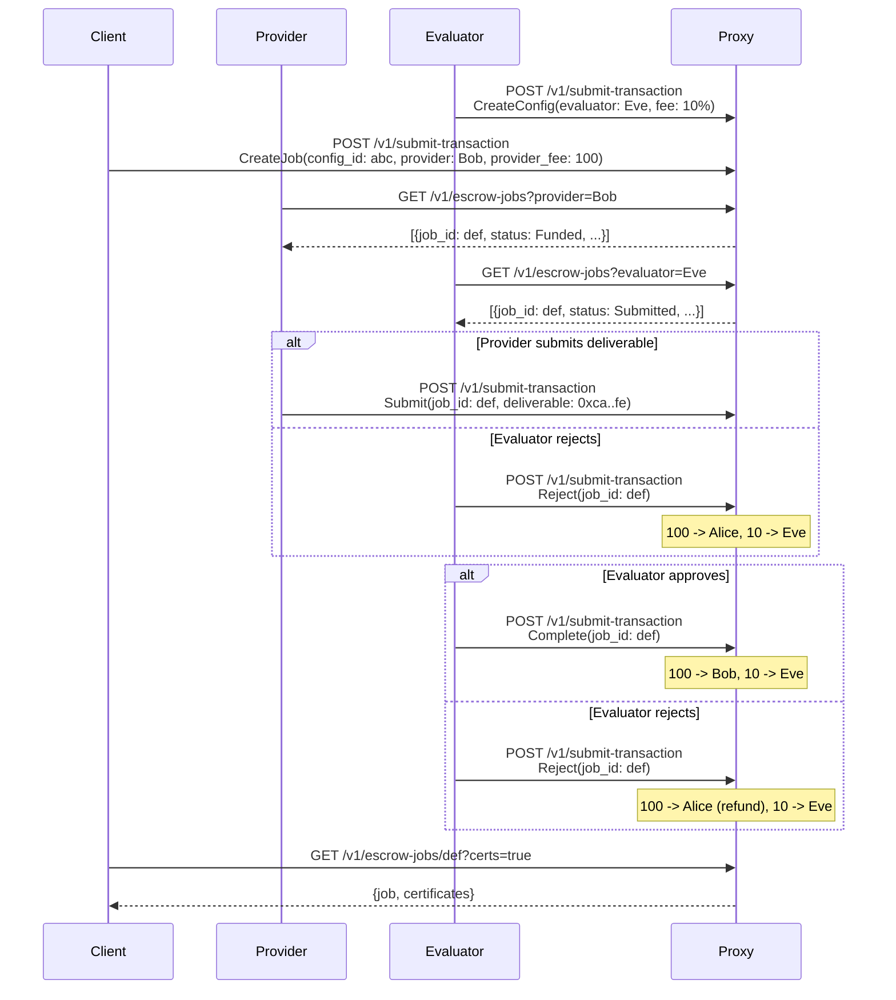

# Escrow Example

Refundable payment flow with three-party escrow: Client, Provider, Evaluator.

## Overview

Enables applications to provide "refundable payment" experiences. A Client funds a job, a Provider submits a deliverable, and an Evaluator decides whether to complete (pay provider) or reject (refund client). The evaluator is always compensated regardless of outcome.

Based on the FastSet paper section 4.11, with naming aligned to [EIP-8183](https://eips.ethereum.org/EIPS/eip-8183).

## Flow

## Roles

- **Client**: Creates and funds escrow jobs.
- **Provider**: Fulfills jobs by submitting a deliverable.
- **Evaluator**: Reviews deliverables and decides to complete or reject.
